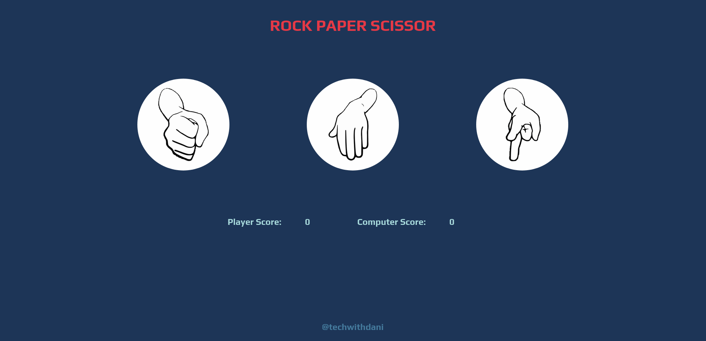

# Rock-Paper-Scissor

This is a simple Rock-Paper-Scissors game implemented using HTML, CSS, and JavaScript. It allows the player to compete against the computer in a series of rounds.

## How to Play

1. Open the index.html file in your web browser.
2. Click on your choice of Rock, Paper, or Scissors.
3. The computer will randomly select its choice.
4. The winner of each round is determined based on the classic Rock-Paper-Scissors rules.
5. The game continues until one player reaches a score of 10.
6. Click the "Try Again" button to reset the game and play again.

## Features

1. Player vs. computer gameplay.
2. Score tracking for both the player and computer.
3. Endgame detection when one player reaches a score of 10.
4. Reset functionality to play the game again.

### Note

Display: 1920 x 1080.
